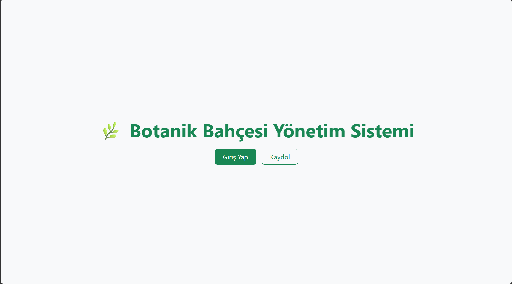
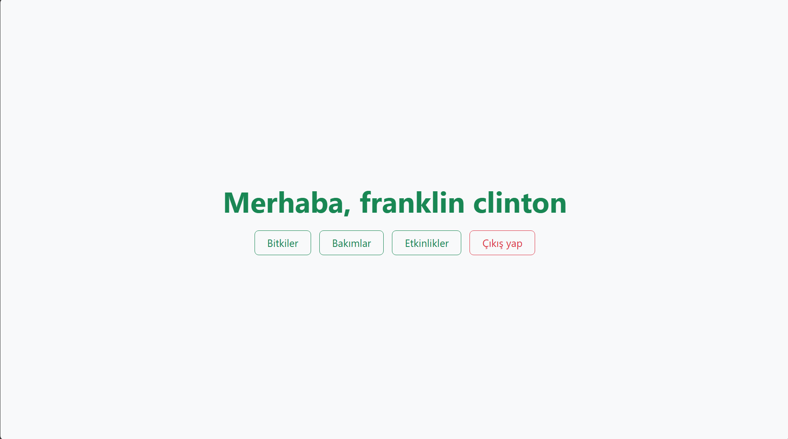

# 🌿 Botanik Bahçesi ve Etkinlik Yönetim Sistemi

Bu proje, bir botanik bahçesindeki bitki envanterini, bitkilerin periyodik bakım/sulama işlemlerini, düzenlenen sosyal/akademik etkinlikleri ve bu etkinliklere ait biletli ziyaretçi kayıtlarını yönetmek amacıyla geliştirilmiş **İlişkisel Veritabanı Tabanlı bir Yönetim Sistemidir**.

Sistem, modern güvenlik standartları ve **Rol Tabanlı Erişim Kontrolü** mimarisi dikkate alınarak tasarlanmıştır.

---

---

## 🛠️ Kullanılan Teknolojiler

* **Backend:** PHP 8.x (Nesne tabanlı oturum yönetimi ve MySQLi API)
* **Database:** MySQL (İlişkisel veri tabanı mimarisi, Cascade kısıtlamaları)
* **Frontend:** HTML5, CSS3, Bootstrap 5 (Responsive / Mobil uyumlu arayüz)
* **Güvenlik:** BCrypt şifreleme motoru, SQL Injection ve IDOR koruma kalkanları

---

## 🔑 Rol Tabanlı Erişim Kontrolü ve Yetki Matrisi

Sistemde karmaşayı önlemek ve veri güvenliğini sağlamak amacıyla her kullanıcının yapabileceği işlemler rollerine göre sınırlandırılmıştır:

| Modül / Sayfa | Misafir (Girişsiz) | User (Kullanıcı) | Staff (Personel) | Organizer (Organizatör) | Admin (Yönetici) |
| :--- | :---: | :---: | :---: | :---: | :---: |
| **Giriş / Kayıt** | ✅ | ❌ | ❌ | ❌ | ❌ |
| **Bitki Listeleme** | ❌ | ✅ | ❌ | ❌ | ✅ |
| **Bitki Ekle / Düzenle / Sil** | ❌ | 🔒 *Sadece Kendi Verisi* | ❌ | ❌ | ✅ *(Tam Yetki)* |
| **Bakım / Sulama Günlüğü** | ❌ | ❌ | ✅ | ❌ | ✅ *(Tam Yetki)* |
| **Etkinlik Yönetimi** | ❌ | ❌ | ❌ | ✅ | ✅ *(Tam Yetki)* |
| **Ziyaretçi & Bilet İşlemleri**| ❌ | ❌ | ❌ | ✅ | ✅ *(Tam Yetki)* |

---

---
## 👤 Öntanımlı Kullanıcılar

Sistemde önkayıtlı kullanıcılar

| Kullanıcı\Nitelik | Kullanıcı adı | Ad Soyad | Şifre | Rol |
| :--- | :---: | :---: | :---: | :---: |
| **admin** | admin | admin | admin | admin |
| **staff** | staff | staff | staff | staff |
| **organizer** | organizer | organizer | organizer | organizer |
| **franklin** | franklin | Franklin Clinton | franklin | user |
| **michael** | michael | Michael De Santa | michael | user |
| **trevor** | trevor | Trevor Philips | trevor | user |
---

## 📐 Veritabanı İlişki Mimarisi (Database Schema)

Veritabanı yapısı, gereksiz veri tekrarını önlemek amacıyla **3. Normal Form (3NF)** kurallarına uygun olarak ilişkisel biçimde tasarlanmıştır.

### 1. `users` (Kullanıcılar Tablosu)
* `user_id` (INT, Primary Key, Auto Increment)
* `username` (VARCHAR)
* `password` (VARCHAR) -> *BCrypt ile hashlenmiş veri*
* `name` (VARCHAR)
* `role` (ENUM: 'user', 'staff', 'organizer', 'admin')

### 2. `plants` (Bitkiler Tablosu)
* `plant_id` (INT, Primary Key, Auto Increment)
* `user_id` (INT, Foreign Key -> `users.user_id`) -> *Bitkinin sahibini belirler*
* `botanical_name` (VARCHAR) -> *Latince Adı*
* `common_name` (VARCHAR) -> *Halk Arasındaki Adı*
* `garden_section` (VARCHAR) -> *Bulunduğu Sera Bölümü*
* `planted_date` (DATE)
* *Kısıtlama:* `ON DELETE CASCADE ON UPDATE CASCADE`

### 3. `maintenance_logs` (Bakım Günlüğü Tablosu)
* `m_id` (INT, Primary Key, Auto Increment)
* `plant_id` (INT, Foreign Key -> `plants.plant_id`)
* `user_id` (INT, Foreign Key -> `users.user_id`) -> *Bakımı yapan personel*
* `action_type` (VARCHAR) -> *Sulama, Budama, İlaçlama, Gübreleme*
* `action_date` (DATE)
* `notes` (TEXT)

### 4. `events` (Etkinlikler Tablosu)
* `event_id` (INT, Primary Key, Auto Increment)
* `title` (VARCHAR)
* `description` (TEXT)
* `start_date` (DATETIME)
* `end_date` (DATETIME)
* `location` (VARCHAR)

### 5. `visitors` (Ziyaretçiler & Biletler Tablosu)
* `visitor_id` (INT, Primary Key, Auto Increment)
* `event_id` (INT, Foreign Key -> `events.event_id`, Nullable) -> *Katıldığı Etkinlik*
* `full_name` (VARCHAR)
* `visit_date` (DATE)
* `ticket_type` (VARCHAR) -> *Tam, Öğrenci, Ücretsiz, Protokol*

---

## 🛡️ Uygulanan Güvenlik Önlemleri

### 1. Kriptografik Şifreleme (BCrypt)
Kullanıcı şifreleri veritabanına asla düz metin (plain-text) olarak kaydedilmez. PHP'nin `password_hash()` fonksiyonu kullanılarak **BCrypt** algoritması ile geri döndürülemez şekilde maskelenir. Güvenlik açığı oluşturan hızlı algoritmaların (MD5, SHA-256) aksine işlemciyi doğrulamada zaman odaklı yorarak *Brute-Force* ve *Rainbow Tables* saldırılarını engeller.

### 2. IDOR (Insecure Direct Object Reference) Koruması
Kullanıcıların sadece arayüzdeki butonları gizlenmez, aynı zamanda tarayıcının URL satırından el ile id değiştirerek (`edit_plant.php?id=X`) başkasının verisine sızması engellenir. SQL sorgusuna eklenen `AND user_id = $active_user_id` şartı ile veri sahipliği sunucu tarafında doğrulanır.

### 3. SQL Injection Önlemi
Kullanıcılardan formlar veya URL parametreleri aracılığıyla gelen tüm dinamik veriler veritabanına gönderilmeden önce `mysqli_real_escape_string()` süzgecinden geçirilerek SQL enjeksiyon zafiyetleri tamamen kapatılmıştır.

### 4. Veri Bütünlüğü ve Cascade Kısıtlamaları
Veritabanı düzeyinde kurulan yabancı anahtar ilişkileri sayesinde, sistemden bir kullanıcı silindiğinde ona ait bitki kayıtları (`ON DELETE CASCADE`); veya bir bitki silindiğinde ona bağlı bakım geçmişi otomatik olarak temizlenir, yetim veri (orphan data) oluşumu engellenir.